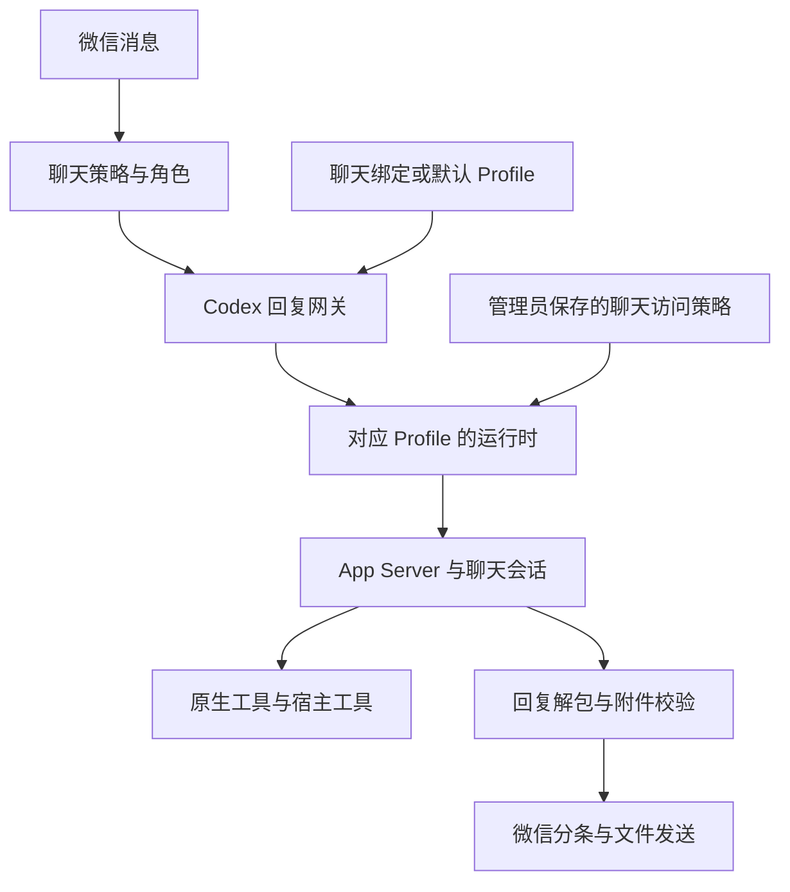

# Codex Profile 配置与权限架构

本文介绍 Mabobot 如何组织 Codex 的账号模型、聊天配置、运行会话和权限边界，不记录具体部署中的账号、模型、群聊绑定或参数数值。

## 配置分层

Profile 决定使用哪个账号和模型；聊天访问策略决定该聊天能够访问哪些文件和工具。两者独立，切换 Profile 不会自动提升聊天权限。

| 配置层 | 职责 | 管理位置 |
| --- | --- | --- |
| Codex Profile | 认证来源、供应商、模型、模型默认参数、独立 Codex 配置目录 | Codex 运行中心 |
| 聊天策略 | 是否启用助手、触发与续聊规则、绑定 Profile 或继承默认值 | 聊天配置 |
| 聊天角色 | 人设、语言风格、回复格式与拟人分条规则 | 角色配置与聊天绑定 |
| 聊天访问模式 | 本机文件范围、shell 网络和提权策略 | 聊天权限配置 |
| 运行任务类型 | 交互或批处理进程池、优先级和会话生命周期 | 应用运行时 |

代码中的 `AgentProfile` 表示最后一层的任务调度策略，与控制台中保存账号和模型的 Codex Profile 不同。微信业务插件的授权也单独管理，选择 Profile 不会自动获得所有插件权限。

## 一次聊天请求的流向

交互式助手的最终回复通过专用网关进入 Codex。Judge、图片理解和其他辅助任务可以使用通用模型路由；“模型配置”中的本地 Codex 单次调用也有自己的任务参数，不应与聊天 Profile 的选择混为一谈。

聊天明确绑定的 Profile 优先于全局默认 Profile。未绑定的聊天继承默认值，因此修改默认值只影响继承它的聊天。Profile 不存在或未完成认证时，不能通过更换人设或聊天指令绕过检查。

## 配置来源与覆盖关系

配置按职责合成，不存在一个适用于所有字段的统一覆盖顺序：

- **模型与认证**：来自选中的 Profile；支持 ChatGPT 登录和 Responses 兼容接口认证。
- **推理等请求参数**：Assistant 的明确设置可以覆盖 Profile 默认参数；选择继承时保留相应默认行为。
- **搜索**：由请求和 Assistant 搜索设置传入运行时。Profile 的能力声明用于描述或配置模型能力，不等同于网络权限。
- **角色与回复格式**：由角色配置提供，固定规则通过 Codex 的指令通道传入；历史消息和工具结果作为资料处理。
- **访问权限**：由宿主读取管理员保存的聊天策略，在普通请求构造完成后强制注入工作目录、权限配置和工作区范围。聊天文字不能修改这层授权。
- **运行参数**：进程数量、并发、队列和运行时维护由应用配置控制。

配置文件可能保留兼容旧版本的字段。实际行为还取决于具体调用入口；例如当前主聊天链路使用持久会话、增量历史和宿主历史工具，并关闭 CLI 回退，不能仅凭同名旧开关判断它是否生效。

## Profile 的认证与存储隔离

每个受管 Profile 都有独立的 `CODEX_HOME`。启动包装脚本为该进程选择对应的配置、认证和 Codex 状态目录，而不是在所有请求之间反复切换一个全局账号。

| 内容 | 用途 |
| --- | --- |
| `config.toml` | 模型、供应商、推理参数、上下文及 Skill 配置 |
| 认证文件 | ChatGPT 登录状态或独立 API 密钥 |
| 模型能力目录 | 为需要该目录的供应商描述模型能力 |
| `skills/` | Profile 自己的 Skill 资产 |
| 会话与运行数据库 | Codex 原生会话状态 |
| `generated_images/` 等工具目录 | 原生工具生成的文件 |

ChatGPT 登录可以通过授权流程建立，也可以复制可用的本机登录缓存。独立配置目录不代表独立订阅：多个 Profile 仍可能使用同一账号。

认证文件由宿主管理，管理接口不返回密钥明文。模型执行的 shell 使用收窄的环境变量继承策略，避免继承供应商凭据。Profile 目录也不是聊天的可读写工作区；只开放所需的只读 Skill 等资源，不因此开放认证和其他会话数据。

## 进程、会话与聊天空间

运行时按 Profile 管理独立的进程池，区分交互请求和批处理任务。进程可以服务多个聊天，但聊天使用各自的 Codex 会话和文件空间；不能把“共享进程”理解为“共享所有历史与权限”。

宿主持久保存聊天到 Codex 会话的映射、配置签名、历史游标及运行记录。正常对话追加新资料并复用会话；上下文压缩由 Codex 处理。权限、Profile、角色等关键条件变化或会话无法恢复时，运行时重新配置或重建会话。

聊天文件空间与 Profile 目录分开：

- 同一群的成员共享该群的工作空间和逻辑会话。
- 不同聊天分配不同空间，输入和产物再按请求组织。
- 切换 Profile 不会把本聊天空间变成另一个群的空间，也不会授权读取全局 Codex 目录。
- 原始聊天档案由宿主持久保存，不能把模型当前上下文当成完整档案。

## 文件与网络权限

| 权限项 | 隔离模式 `isolated` | 管理员私聊 `owner_full` |
| --- | --- | --- |
| 适用对象 | 群聊、普通私聊和未知聊天 | 管理员明确指定的私聊 |
| 工作目录 | 本聊天空间 | 项目工作目录 |
| 文件范围 | 本聊天空间可读写，必要运行组件和 Skills 只读 | 使用最大访问模式，仍受操作系统账号权限约束 |
| shell 网络 | 禁止直接联网 | 不受该隔离禁网策略限制 |
| 提权 | 不允许申请突破隔离范围 | 按请求与自动审批策略处理 |

群聊不能获得管理员私聊模式：管理接口检查一次，运行时再次限制。隔离模式以默认拒绝为基础，仅开放工作区和必要运行资源，并检查目录中的符号链接等越界风险。

**shell 禁网**意味着 `curl`、`wget`、Python HTTP 请求和在线包安装不能直接访问外网、本机接口或局域网。处理已有图片、生成文档、转换本地音视频等离线操作仍可执行。这不是整台电脑断网，也不是禁止所有模型工具联网。

自动审批不是无条件放行。当前实现对自动审批后仍到达 Mabobot 客户端的审批请求采取拒绝处理，没有通过微信继续请求人工审批的交互流程。

控制台负责保存这些管理员配置，目前依赖可信的本机或受控远程访问环境；聊天隔离不替代控制台访问控制，也不是多租户管理系统。

## 工具与 Skill 的权限边界

| 执行通道 | 边界 |
| --- | --- |
| Codex shell | 受当前聊天的文件和网络权限约束 |
| 原生搜索、生图 | 使用 Codex 提供的工具通道；与 shell 直接联网是不同路径 |
| `wx_browser` | 宿主访问允许的公共网页，使用独立浏览环境并限制私网访问 |
| `history` | 宿主绑定当前聊天，提供档案检索、工作副本及成员信息维护 |
| 专门业务工具 | 由宿主按工具定义限制资源、操作及授权对象 |
| 微信发送 | 宿主通过微信服务执行，不由隔离 shell 直接调用本机发送接口 |

宿主工具绑定当前请求和会话，不因宿主本身能访问资源，就向模型开放任意路径或任意接口。部分工具可以维护本聊天档案，不能把所有宿主工具统称为只读。

Skills 提供任务流程和工具使用说明，本身不会授予额外权限。控制台按 Profile 管理自定义 Skills；公共运行资源可以只读共享。启用 Skill 不等于允许联网、读取其他群文件或取得外部账号凭据。

## 生成文件与最终交付

原生工具可能将文件保存在聊天空间之外。宿主负责在工具产物与聊天可交付文件之间完成受控交接，无需开放整个 `generated_images` 目录。

App Server 聊天将“文件已生成”和“文件需要发送”分别处理：

1. 成功工具事件提供本次请求中可信的原生图片来源。
2. 模型在原有最终回复中列出最终附件，排除参考素材、文档插图和废弃版本。
3. 宿主校验选中的文件，并将需要导入的图片复制到本次输出目录；普通文档等最终文件直接写入该目录。
4. 校验成功后，正文进入原有回复流程，附件单独发送；选中文件缺失或无效时，交付失败。

普通文字角色和拟人分条角色都使用这套交付协议。后者的原始回复 schema 嵌入交付结构，宿主解包后仍按原有状态、消息数量和顺序处理，不把附件路径混入微信文字。正常交付不增加模型轮次。

显式纯文本辅助调用不使用附件协议。旧格式兼容分支、独立 CLI 和图片流入口的具体边界见附件专题，不应假定所有调用入口都使用相同协议。

## 配置生命周期与相关文档

Profile 或 Skill 配置变更会使对应运行时缓存失效，后续按新配置加载。更改聊天权限会更新访问签名；删除 Profile 会处理默认值和聊天绑定。排障应同时查看实际 Profile、聊天权限、运行会话与工具事件，不能只检查某一个配置文件。

- [模型连接、上下文与用量显示](MODEL_CONFIGURATION.md)
- [聊天档案与线程上下文](CHAT_ARCHIVE_OPERATIONS.md)
- [Profile Skill 管理](CODEX_SKILL_MANAGEMENT.md)
- [受限浏览器工具](CODEX_BROWSER_TOOL.md)
- [附件交付协议](codex-attachment-delivery.md)
- [系统配置归属](SYSTEM_CONFIGURATION.md)
